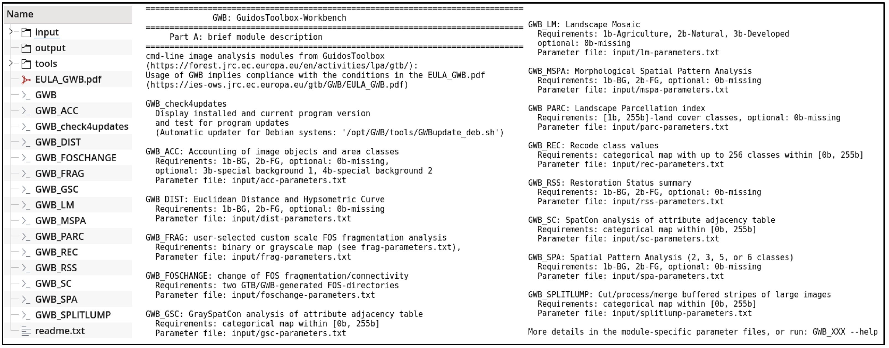

GuidosToolbox Workbench (GWB)
=============================

*GuidosToolbox Workbench* `(GWB) <https://forest.jrc.ec.europa.eu/en/activities/lpa/gwb/>`_
contains the most popular image analysis modules of the desktop application *GuidosToolbox* 
`(GTB) <https://forest.jrc.ec.europa.eu/en/activities/lpa/gtb/>`_. 
The individual GWB modules are setup as command-line applications for image processing 
on Linux server or desktop installations.
The open source code of GWB and all dependencies is released under GPL version 3 on 
`GitHub <https://github.com/ec-jrc/GWB>`_. Using the compiled version of GWB implies 
acceptance of the `GWB-EULA <https://ies-ows.jrc.ec.europa.eu/gtb/GWB/EULA_GWB.pdf>`_. 

**This document describes GWB version 1.9.5,** 
`changelog <https://ies-ows.jrc.ec.europa.eu/gtb/GWB/GWB_changelog.txt>`_

Citation
--------

Vogt P., Riitters K., Rambaud P., d'Annunzio R., Lindquist R., Pekkarinen A. (2022). 
GuidosToolbox Workbench: spatial analysis of raster maps for ecological applications, 
Ecography, Volume 2022, Issue 3, 
doi: `10.1111/ecog.05864 <https://doi.org/10.1111/ecog.05864>`_

Acknowledgement
---------------

A big thank you to `Pierrick Rambaud <https://github.com/12rambau>`_ for his help on 
developing this website and `Loïc Dutrieux <https://github.com/loicdtx>`_ for setting 
it up on readthedocs.

.. toctree::
   :hidden:

   installation
   usage/index
