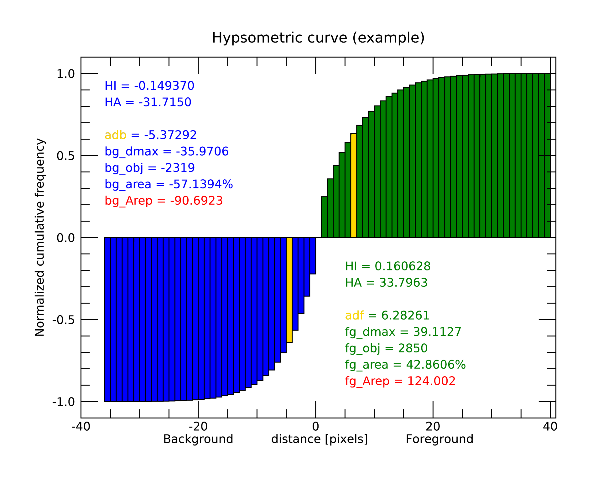
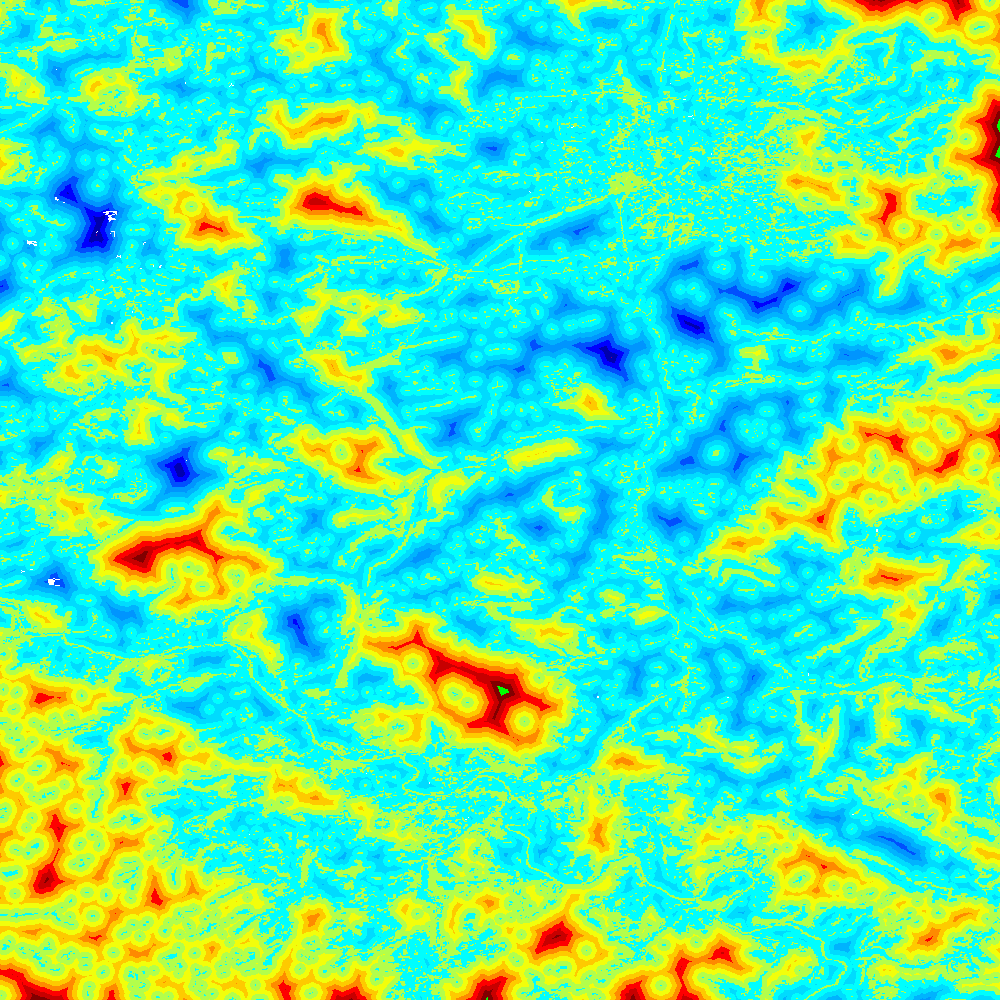

Distance (GWB_DIST)
===================

This module will conduct the **Euclidean Distance** analysis. Each pixel will show the 
shortest distance to the foreground boundary. Pixels inside a foreground object have a 
positive distance value while background pixels have a negative distance value. The 
result are spatially explicit maps and tabular summary statistics.
Details on the methodology and input/output options can be found in the 
`Distance <https://ies-ows.jrc.ec.europa.eu/gtb/GTB/psheets/GTB-Distance-Euclidean.pdf>`_ 
product sheet.

Requirements
------------

A single band (Geo)TIFF image in data format byte:

-   0 byte: missing (optional)
-   1 byte: background
-   2 byte: foreground (forest)

Processing parameter options are stored in the file :code:`input/dist-parameters.txt`.

.. code-block:: text

    ;;;;;;;;;;;;;;;;;;;;;;;;;;;;;;;;;;;;;;;;;;;;;;;;;;;;;;;;;;;;;;;;;;;;;;;;;;;;
    ;; GTB_DIST parameter file:
    ;; NOTE: do NOT delete or add any lines in this parameter file!
    ;;
    ;; DIST: Euclidean Distance + Hypsometric Curve
    ;; Input image requirements: 1b-background, 2b-foreground, optional: 0b-missing
    ;;
    ;; Please specify entries at lines 17-18 ONLY using the following options:
    ;;
    ;; line 17: Foreground connectivity: 8 (default) or 4
    ;; line 18: 1-Eucl.Distance only   or  2- Eucl.Distance + Hysometric Curve
    ;;
    ;; an example parameter file with default settings would look like this:
    ;; 8
    ;; 1
    ****************************************************************************
    8
    2
    ****************************************************************************

Example
-------

The results are stored in the directory :code:`output`, one directory for each input 
image accompanied by a log-file providing details on computation time and processing 
success of each input image.

:code:`GWB_DIST` command and listing of results in the directory output:

.. code-block:: console

    $ GWB_DIST -i=$HOME/input -o=$HOME/output
    IDL 8.8.3 (linux x86_64 m64).
    (c) 2023, Harris Geospatial Solutions, Inc.

    GWB_DIST using:
    dir_input= $HOME/input
    dir_output= $HOME/output
    % Loaded DLM: TIFF.
    Done with: clc3class.tif
    % Loaded DLM: LAPACK.
    % Loaded DLM: PNG.
    Done with: example.tif
    DIST finished sucessfully

    $ ls -R output/
    output/:
    dist.log  example_dist/

    output/example_dist:
    example_dist_hist.png      example_dist_hmc.csv  example_dist_hmc.png
    example_dist_hmc.txt       example_dist.tif      example_dist.txt
    example_dist_viewport.tif

Example statistics (hypsometric curve) and spatial result of input 
image :code:`example.tif`:

Remarks
-------

-   The result provides additional statistics in txt and csv format.
-   Spatially explicit distance per-pixel values are shown in a pseudo-elevation color 
    map. Positive values are associated with land (forest: yellow, orange, red, green), 
    negative values with sea (non-forest: cyan to dark blue). A value of zero 
    corresponds to the coast line (forest– non-forest boundary).
-   Actual per-pixel distance values are provided in a dedicated image 
    (<filename>\_\*dist.tif not shown here)
-   Per-pixel distance values can be summarized with the Hypsometric curve (see above).

**Euclidean Distance** maps of forest patches have been used to map and summarize 
forest fragmentation, see for example `Kozak et al <https://doi.org/10.3390/su10051472>`_.
