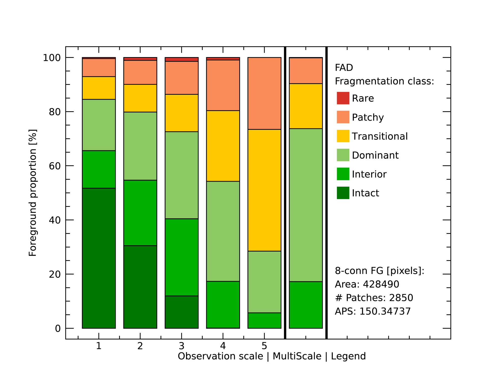
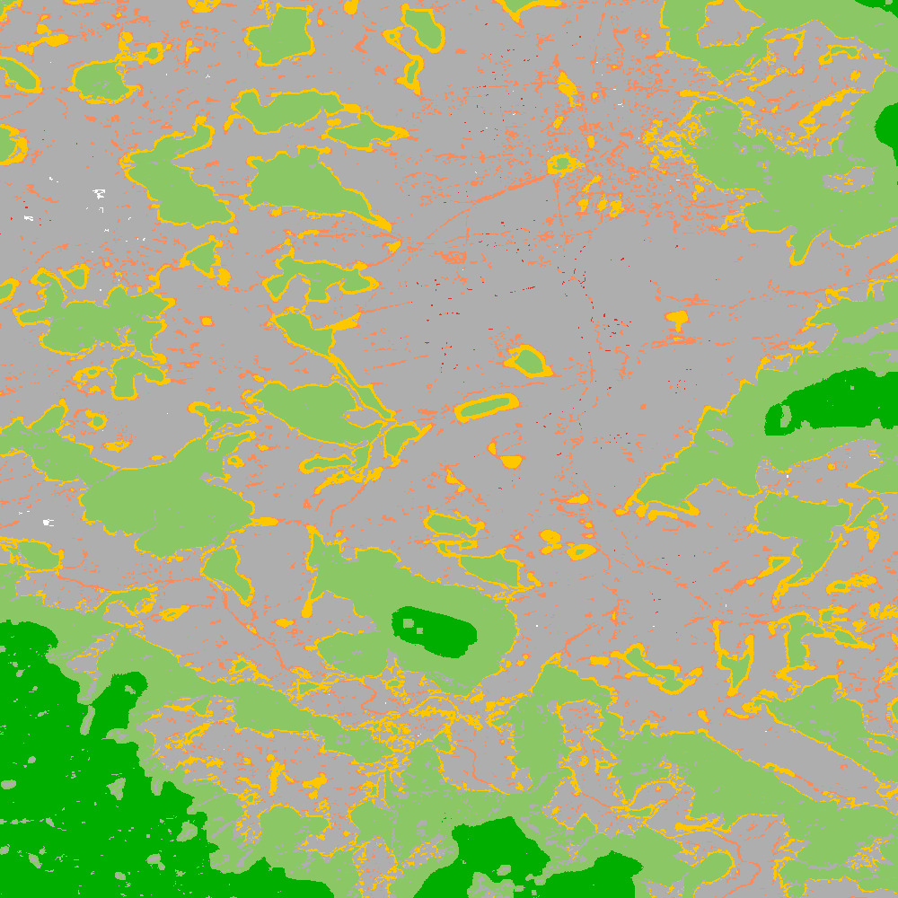

fixed-fragmentation (GWB_FAD)
=============================

This module will conduct the **fragmentation** analysis at **five fixed observation scales**. Because forest fragmentation is scale-dependent, fragmentation is reported at five observation scales, which allows different observers to make their own choice about scales and threshold of concern. The change of fragmentation across different observation scales provides additional interesting information. Fragmentation is measured by determining the Forest Area Density (**FAD**) within a shifting, local neighborhood. It can be measured at pixel or patch level. The result are spatially explicit maps and tabular summary statistics. Details on the methodology and input/output options can be found in the `Fragmentation <https://ies-ows.jrc.ec.europa.eu/gtb/GTB/psheets/GTB-Fragmentation-FADFOS.pdf>`_ product sheet.

Requirement
-----------

Single band geotiff in data format byte:

-   0 byte: missing (optional)
-   1 byte: background
-   2 byte: foreground (forest)
-   3 byte: specific background (optional)
-   4 byte: non-fragmenting background (optional)

Processing parameter options are stored in the file :code:`input/fad-parameters.txt`.

.. code-block:: text

    ;;;;;;;;;;;;;;;;;;;;;;;;;;;;;;;;;;;;;;;;;;;;;;;;;;;;;;;;;;;;;;;;;;;;;;;;;;;;
    ;; GTB_FAD parameter file:
    ;;    ***  do NOT delete header lines starting with ";;" ***
    ;;
    ;; FAD = multi-scale fragmentation analysis at fixed observation scales of
    ;; [7x7, 13x13, 27x27, 81x81, 243x243] pixels
    ;;
    ;; FAD: per-pixel density, color-coded into 6 fragmentation classes
    ;; FAD-APP2: average per-patch density, color-coded into 2 classes
    ;; FAD-APP5: average per-patch density, color-coded into 5 classes
    ;;
    ;; Input image requirements: 1b-background, 2b-foreground, optional:
    ;;    0b-missing, 3b-special background, 4b-non-fragmenting background
    ;;
    ;; FAD will provide 5+1 images and summary statistics.
    ;;
    ;; Please specify entries at lines 28-30 ONLY using the following options:
    ;; line 28: FAD  or  FAD-APP2  or  FAD-APP5
    ;; line 29: Foreground connectivity: 8 (default) or 4
    ;; line 30: high-precision: 1 (default) or 0
    ;;         (1-float precision, 0-rounded byte)
    ;;
    ;; an example parameter file doing FAD-APP5 and using 8-connected foreground:
    ;; FAD-APP5
    ;; 8
    ;; 1
    ****************************************************************************
    FAD
    8
    1
    ****************************************************************************

Example
-------

The results are stored in the directory :code:`output`, one directory for each input image accompanied by a log-file providing details on computation time and processing success of each input image.

:code:`GWB_FAD` command and listing of results in the directory output:

.. code-block:: console

    $ GWB_FAD -i=~/input -o=~/output
    IDL 8.8.0 (linux x86_64 m64).
    (c) 2020, Harris Geospatial Solutions, Inc.

    GWB_FAD using:
    dir_input= ~/input
    dir_output= ~/output
    % Loaded DLM: TIFF.
    % Loaded DLM: LAPACK.
    % Loaded DLM: PNG.
    Done with: clc3class.tif
    Done with: example.tif
    FAD finished sucessfully

    $ ls -R output/
    output/:
    clc3class_fad  example_fad  fad.log

    output/clc3class_fad:
    clc3class_fad_13.tif      clc3class_fad_27.tif       clc3class_fad_81.tif
    clc3class_fad_mscale.csv  clc3class_fad_mscale.tif   clc3class_fad_243.tif
    clc3class_fad_7.tif       clc3class_fad_barplot.png  clc3class_fad_mscale.sav
    clc3class_fad_mscale.txt

    output/example_fad:
    example_fad_13.tif      example_fad_27.tif       example_fad_81.tif
    example_fad_mscale.csv  example_fad_mscale.tif   example_fad_243.tif
    example_fad_7.tif       example_fad_barplot.png  example_fad_mscale.sav
    example_fad_mscale.txt

Example statistics and spatial result of a multi-scale per-pixel analysis of the input image :code:`example.tif`:

Remarks
-------

-   The result provides additional statistics in txt and csv format.
-   The IDL-specific sav-file contains all information to conduct fragmentation change analysis in GTB.
-   In addition to the above multi-scale image, the result provides fragmentation images at each of the 5 fixed observation scales.
-   Options to report at pixel- or patch-level and to select the number of fragmentation classes (6, 5, 2).

Fragmentation has been used to map and summarize the degree of forest fragmentation by Riitters et al. (`2002 <https://doi.org/10.1007/s10021-002-0209-2>`_, `2012 <https://doi.org/10.1038/srep00653>`_) as well as the US Forest Inventory and Analysis (`FIA <https://www.fia.fs.fed.us/>`_) reports since 2003.