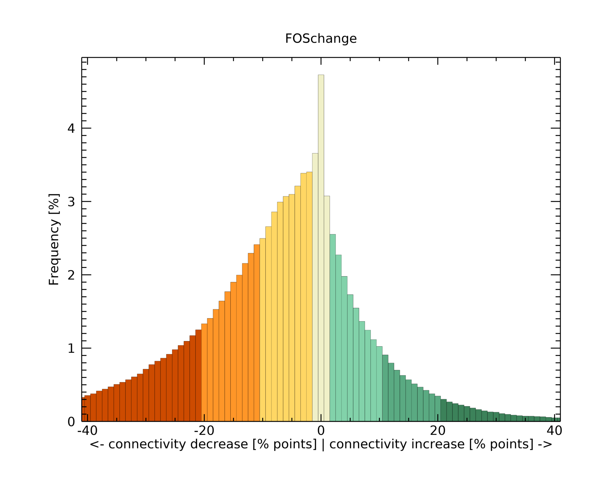

Connectivity Change (GWB_FOSCHANGE)
===================================

This module conducts a temporal **change analysis** of a GTB/GWB FOS fragmentation/connectivity. 
The result consists of a spatially explicit change map,
a change histogram, and tabular summary statistics. Details on the methodology and input/output 
options can be found in the section FOS change analysis of the 
`Fragmentation <https://ies-ows.jrc.ec.europa.eu/gtb/GTB/psheets/GTB-Fragmentation-FADFOS.pdf>`_ 
product sheet.

Requirements
------------

We assume to have two GeoTIFF input maps of time A and time B.
To be comparable, both maps must have a fully matching geoheader information: the same map extent, 
pixel resolution, (equal-area) projection, position, and map dimension in x/y.

1. Place the two matching input maps in the directory :code:`input` and run a FOS-analysis **including statistics** via the :code:`GWB_FRAG` module.
2. Empty the directory :code:`input`.
3. Move the resulting two GTB/GWB-generated FOS-directories from the directory :code:`output` into the directory :code:`input` and empty the directory  :code:`output`.
4. Specify the full path to the two GTB/GWB-generated FOS-tif maps in the file :code:`input/foschange-parameters.txt`.
5. Run the GWB_FOSCHANGE module

.. note::

   The :code:`GWB_FOSCHANGE` module will exit with an error if the two FOS-directories are not GTB/GWB-generated or have incompatible GeoTIFF FOS maps. 

Example of processing parameters in the file :code:`input/foschange-parameters.txt`.

.. code-block:: text

    ;;;;;;;;;;;;;;;;;;;;;;;;;;;;;;;;;;;;;;;;;;;;;;;;;;;;;;;;;;;;;;;;;;;;;;;;;;;;
    ;; GWB_FOSCHANGE parameter file:
    ;; NOTE: do NOT delete or add any lines in this parameter file!
    ;; Change analysis of GTB/GWB-generated FOS-analysis
    ;; for example results of GWB_FRAG using FAD/FED/FAC_5/6 only, no FAD-APP/FED-APP!
    ;;
    ;; The result of GWB_FOSCHANGE (FOSchange.tif/csv/png, FOSchange_hist/colors.csv) are written into
    ;; the default output directory in standalone mode or the user-specified directory
    ;; 
    ;; Requires two unmodified GTB/GWB-generated FOS-analysis directories of a FAD/FED/FAC_5/6 FOS analysis
    ;; The input directory must have the following GTB/GWB-generated files:
    ;; 1) the <FAD/FED/FAC>.png (histogram graph)
    ;; 2) the <FAD/FED/FAC>.sav (IDL-formatted summary statistics, mandatory)
    ;; 3) the <FAD/FED/FAC>.tif (GeoTIFF map of fragmentation/connectivity, mandatory)
    ;; 4) the <FAD/FED/FAC>.csv (fragmentation/connectivity summary spreadsheet)
    ;; 5) the <FAD/FED/FAC>.txt (fragmentation/connectivity summary plain text file)
    ;;
    ;; Please specify entries at lines 26-27 ONLY using the following syntax:
    ;; line 26: full path to the GTB/GWB-generated Fragmentation/Connectivity GeoTIFF map at time 1
    ;; line 27: full path to the GTB/GWB-generated Fragmentation/Connectivity GeoTIFF map at time 2
    ;;
    ;; example parameter file: specify the full path to the two FOS GeoTIFFS:
    ;; $HOME/input/FOS1/fm1990_fos-fad_5class_31.tif
    ;; $HOME/input/FOS2/fm2018_fos-fad_5class_31.tif
    ****************************************************************************
    $HOME/input/PTfm1990_frag/PTfm1990_fos-fad_5class_31.tif
    $HOME/input/PTfm2018_frag/PTfm2018_fos-fad_5class_31.tif
    ****************************************************************************

Example
-------

The resulting five files (FOSchange.tif/csv/png and FOSchange_hist/colors.csv) are stored in the directory :code:`output` 
together with a log-file providing details on computation time, peak RAM usage and processing.

:code:`GWB_FOSCHANGE` command and listing of results in the directory output:

.. code-block:: console

    $ GWB_FOSCHANGE -i=$HOME/input -o=$HOME/output
    IDL 9.2.0 (linux x86_64 m64).
    (c) 2025, NV5 Geospatial Solutions, Inc.

    GWB_FOSCHANGE using:
    dir_input= $HOME/input
    dir_output= $HOME/output
    % Loaded DLM: TIFF.
    % Loaded DLM: LAPACK.
    % Loaded DLM: PNG.
    FOSchange finished sucessfully

    $ ls -R output/
    output/:
    FOSchange.csv FOSchange_hist.csv FOSchange_hist.csv foschange.log 
    FOSchange.png FOSchange.tif
    

Example statistics and spatial result of a FOSCHANGE analysis of two GWB_FRAG analysis
using the fos-fad_5class reporting scheme.

1. The connectivity change map (:code:`FOSchange.tif`): shows areas of insignificant change (light gray), 
three degrees of connectivity decrease (yellow, orange, red) and increase (green tones), 
water at either time (blue), and Foreground gain (bright green) and loss (black):

.. figure:: ../_image/FOSchange.tif
    :width: 100%

2. The connectivity change histogram summary (:code:`FOSchange.png`): shows the proportion 
of connectivity change for and normalised to the the area that is Foreground at both times. 
Connectivity change is color-coded into seven classes: insignificant change [-1, 1]%, three 
classes of connectivity decrease ([-100, -21], [-20, -11], [-10, -2]%) and three classes of 
connectivity increase ([2, 10], [11, 20], [21, 100]%). 

3. The connectivity change matrix summary file ( :code:`FOSchange.csv`): shows summary 
statistics of processing options and status and trend summaries for the two FOS maps.

.. code-block:: text

    1) General info:
    Change typ: fos-fad_5class_31: change from A -> B
    A: /home/user/input/PTfm1990_frag/PTfm1990_fos-fad_5class_31.tif
    B: /home/user/input/PTfm2018_frag/PTfm2018_fos-fad_5class_31.tif
    Pixel resolution [m]: 100.000
    Window size: 31x31
    Observation scale: 961.000 hectares ~ 2374.68 acres
    Map area [pixels]: 20475000
    
    2) Land cover status of A and B
    Land cover   Pixel value A-Pixels B-Pixels   A-%   B-%  Net change-Pixels
    Foreground     [0 - 100]  3544408  2560104  17.3  12.5            -984304
    Background [101 105 106] 12705784 13690474  62.1  66.9             984690
    Missing            [102]  4224808  4224422  20.6  20.6               -386
    
    3) Land cover change matrix
    A->B [pixels] B-Foreground  B-Background  B-Missing
    A-Foreground       1828450       1715957          1
    A-Background        731654      11973123       1007
    A-Missing                0          1394    4223414
    
    4) FAD status: 5 classes
     FAD        FG cover Connectivity Fragmentation  A-pixels B-pixels  A-%   B-%
    [0 9]           Rare     Very low     Very high     52689    93472  1.5   3.7
    [10 39]       Patchy          Low          High    983029   100971 27.7  39.4
    [40 59] Transitional Intermediate  Intermediate   1005188   765003 28.4  29.9
    [60 89]     Dominant         High           Low   1248124   639475 35.2  25.0
    [90 100]    Interior    Very high      Very low    255378    52439  7.2   2.0
    
    Average Connectivity    A     B  Absolute difference  Relative difference
    AVCON [%]            11.9   7.1                 -4.8                -40.2
    FAD_AV [%]           54.4  45.0                 -9.4                -17.2
    
    5) FAD change histogram: 7 classes, degree in DeltaFAD (= FAD change)
     DeltaFAD      Connectivity       Color    Pixels    %
    [-100 -21]    High decrease           RED  350027  19.1
    [-20  -11]  Medium decrease        ORANGE  337221  18.4
    [-10 -2]       Low decrease        YELLOW  496801  27.2
    [-1 +1]       Insignificant          GRAY  209545  11.5
    [+2 +10]       Low increase   LIGHT GREEN  271212  14.8
    [+11 +20]   Medium increase  MEDIUM GREEN  104873   5.7
    [+21 +100]    High increase    DARK GREEN   58771   3.2
    Note: Change histogram is constrained to FORCOM [pixels]: 1828450
    
    6) FAD change matrix: 5 classes, FAD status change from A->B
    A->B [pixels]  B0-Background B1-Rare B2-Patchy B3-Transitional B4-Dominant B5-Interior
    A0-Background       11973123   45905    361493          198439      117982        7835
    A1-Rare                29774   12995      8857             842         204          17
    A2-Patchy             531054   27374    339199           69917       14892         593
    A3-Transitional       474238    3932    198227          262461       65433         897
    A4-Dominant           563007    2768     91482          212239      365189       13438
    A5-Interior           117884     498     10457           21105       75775       29659
    Note: Change matrix is constrained to FORCOM [pixels]: 1828450
    Same status class - matrix diagonal [pixels]: 1009503
    Different status classes [pixels]: 818947
    Connectivity increase (=fragmentation decrease) - above the matrix diagonal [pixels]:  906744
    Connectivity decrease (=fragmentation increase) - below the matrix diagonal [pixels]: 2359814
    
    FAD change matrix: normalised by the 818947 pixels in different FAD status classes [%]:
    A->B [%]         B1-Rare B2-Patchy B3-Transitional B4-Dominant B5-Interior
    A1-Rare              0.0       1.1             0.1         0.0         0.0
    A2-Patchy            3.3       0.0             8.5         1.8         0.1
    A3-Transitional      0.5      24.2             0.0         8.0         0.1
    A4-Dominant          0.3      11.2            25.9         0.0         1.6
    A5-Interior          0.1       1.3             2.6         9.3         0.0
    Connectivity increase (=fragmentation decrease) - above the matrix diagonal [%]: 21.4
    Connectivity decrease (=fragmentation increase) - below the matrix diagonal [%]: 78.6
    
4. The connectivity change histogram summary file ( :code:`FOSchange_hist.csv`): shows a
tabular summary of the full range of the change histogram [-100, 100]%: the histogram index
and the corresponding pixel value in the map, connectivity change value, occurence frequency,
connectivity change class, color, and RGB color code.

.. code-block:: text

    Histogram Pixel-Value  Delta-FAD  FREQUENCY Connectivity-Class    Color         RGB
        0        200            -100         0       High decrease     RED        205/75/0
        1        199             -99         0       High decrease     RED        205/75/0
        2        198             -98         0       High decrease     RED        205/75/0
        3        197             -97         0       High decrease     RED        205/75/0
        4        196             -96        12       High decrease     RED        205/75/0
        5        195             -95        32       High decrease     RED        205/75/0
      ...        ...             ...       ...            ...          ...           ...
       98        102              -2     62213        Low decrease   YELLOW    255/215/100
       99        101              -1     66876       Insignificant  LIGHTGRAY  240/240/220
      100        100               0     86441       Insignificant  LIGHTGRAY  240/240/220
      101         99               1     56228       Insignificant  LIGHTGRAY  240/240/220
      102         98               2     46670        Low increase  LIGHTGREEN 130/210/170
      ...        ...             ...       ...            ...          ...           ...
      191          9              91         5       High increase  DARKGREEN    60/130/90
      192          8              92         2       High increase  DARKGREEN    60/130/90
      193          7              93         0       High increase  DARKGREEN    60/130/90
      ...        ...             ...       ...            ...          ...           ...
      200          0             100         0       High increase  DARKGREEN    60/130/90

5. The map pixel values file ( :code:`FOSchange_colors.csv`): shows a
tabular summary of the unique pixel values found in the connectivity change map: the pixel 
value in the map, connectivity change value, description, color, and RGB color code.

.. code-block:: text

    Pixel-Value  Delta-FAD        Description           Color         RGB
        8            92          High increase        DARKGREEN    60/130/90
        9            91          High increase        DARKGREEN    60/130/90
       10            90          High increase        DARKGREEN    60/130/90
       11            89          High increase        DARKGREEN    60/130/90
      ...           ...              ...                 ...          ...    	    
      195           -95          High decrease              RED     205/75/0
      196           -96          High decrease              RED     205/75/0
      250                      Foreground gain      BRIGHTGREEN      0/255/0
      251                      Foreground loss            BLACK        0/0/0
      252                    Background stable             GRAY  225/225/225
      253                                Water             BLUE     0/99/254
      254                              Missing            WHITE  255/255/255

Remarks
-------

-   This module allows to conduct a connectivity change analysis of either FAD/FED/FAC, but not 
    for Average-Per-Patch reporting, for which a change analysis is not meaningful.
-   More details are available in the section FOS change analysis of the 
    `Fragmentation <https://ies-ows.jrc.ec.europa.eu/gtb/GTB/psheets/GTB-Fragmentation-FADFOS.pdf>`_ product sheet.

