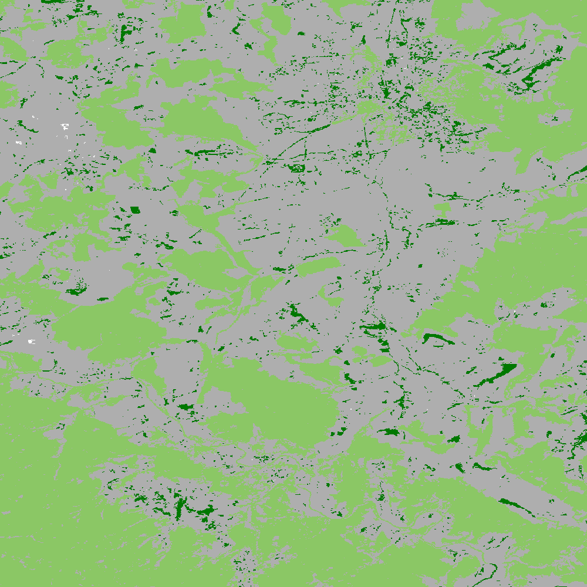

fragmentation (GWB_FRAG)
========================

This module will conduct the **fragmentation** analysis at a **user-selected observation scale**. This module and its options are similar to :doc:`GWB_FAD` but allow the user to specify a single (or multiple) specific observation scale. The result are spatially explicit maps and tabular summary statistics. Details on the methodology and input/output options can be found in the `Fragmentation <https://ies-ows.jrc.ec.europa.eu/gtb/GTB/psheets/GTB-Fragmentation-FADFOS.pdf>`_ product sheet.

Requirements
------------

Single band geotiff in data format byte:

-   0 byte: missing (optional)
-   1 byte: background
-   2 byte: foreground (forest)
-   3 byte: specific background (optional)
-   4 byte: non-fragmenting background (optional)

Processing parameter options are stored in the file :code:`input/frag-parameters.txt`.

.. code-block:: text

    ;;;;;;;;;;;;;;;;;;;;;;;;;;;;;;;;;;;;;;;;;;;;;;;;;;;;;;;;;;;;;;;;;;;;;;;;;;;;
    ;; GTB_FRAG parameter file:
    ;;    ***  do NOT delete header lines starting with ";;" ***
    ;;
    ;; FOS = fragmentation analysis at up to 10 user-selected observation scales
    ;;
    ;; FOS5/6: per-pixel density, color-coded into 5/6 fragmentation classes
    ;; FOS-APP2: average per-patch density, color-coded into 2 classes
    ;; FOS-APP5: average per-patch density, color-coded into 5 classes
    ;;
    ;; Input image requirements: 1b-background, 2b-foreground, optional:
    ;;    0b-missing, 3b-special background, 4b-non-fragmenting background
    ;;
    ;; FOS will provide an image per observation scale and summary statistics.
    ;;
    ;; Please specify entries at lines 32-36 ONLY using the following options:
    ;; line 32: FOS5 (default)  or  FOS6  or  FOS-APP2  or  FOS-APP5
    ;; line 33: Foreground connectivity: 8 (default) or 4
    ;; line 34: pixel resolution [meters]
    ;; line 35: up to 10 window sizes [unit: pixels] in increasing order
    ;;          and separated by a single space.
    ;; line 36: high-precision: 1 (default) or 0
    ;;          (1-float precision, 0-rounded byte)
    ;;
    ;; an example parameter file doing FOS5 and using 8-connected foreground:
    ;; FOS5
    ;; 8
    ;; 100
    ;; 27
    ;; 1
    ****************************************************************************
    FOS-APP2
    8
    100
    23
    1
    ****************************************************************************

Example
-------

The results are stored in the directory :code:`output`, one directory for each input image accompanied by a log-file providing details on computation time and processing success of each input image.

:code:`GWB_FRAG` command and listing of results in the directory output:

.. code-block:: console

    $ GWB_FRAG -i=~/input -o=~/output
    IDL 8.8.0 (linux x86_64 m64).
    (c) 2020, Harris Geospatial Solutions, Inc.

    GWB_FRAG using:
    dir_input= ~/input
    dir_output= ~/output
    % Loaded DLM: TIFF.
    Done with: clc3class.tif
    Done with: example.tif
    Frag finished sucessfully

    $ ls -R output/
    output/:
    clc3class_frag  example_frag  frag.log

    output/clc3class_frag:
    clc3class_FOS-APP2_23.tif  clc3class_FOS-APP2.csv  clc3class_FOS-APP2.sav
    clc3class_FOS-APP2.txt

    output/example_frag:
    example_FOS-APP2_23.tif  example_FOS-APP2.csv  example_FOS-APP2.sav
    example_FOS-APP2.txt

Example statistics and spatial result of custom-scale per patch analysis of the input image :code:`example.tif`, here FOS-APP2 showing Continuous forest patches in light green and Separated forest patches in dark green.

.. code-block:: text

    FOS-APP2: Foreground Area Density summary analysis for image:
    example.tif
    ================================================================================
    8-conn FG: area, # patches, aps [pixels]: 428490, 2850, 150.34737
    Pixel resolution: 100[m], pix2ha: 1.00000, pix2acr: 2.47105
    Observation scale:   1
    Neighborhood area:   23x23
        [hectare]:     529.00
        [acres]:    1307.19
    ================================================================================
    FOS-APP 5-class:
            Rare:      1.2089
        Patchy:      7.1572
    Transitional:      4.2668
        Dominant:     87.3670
        Interior:      0.0000
    FOS-APP 2-class:
    Separated:      8.3661
    Continuous:     91.6339
    ================================================================================
        FOS_av:     75.2900

Remarks
-------

-   The result provides additional statistics in txt and csv format.
-   The IDL-specific sav-file contains all information to conduct fragmentation change analysis in GTB.
-   The result provides one fragmentation image for each custom observation scale. In the example above, the user selected 1 observation scale with local neighborhood of 23x23 pixels.
-   Options to report at pixel- or patch-level and to select the number of fragmentation classes (6, 5, 2).

Fragmentation has been used to map and summarize the degree of forest fragmentation in the `FAO SOFO2020 <http://www.fao.org/publications/sofo/en/>`_ report and the Forest Europe `State of Europe's Forest 2020 <https://foresteurope.org/publications/>`_ report with additional technical details in the respective JRC Technical Reports for `FAO <https://doi.org/10.2760/145325>`_ and `FE <https://doi.org/10.2760/991401>`_.