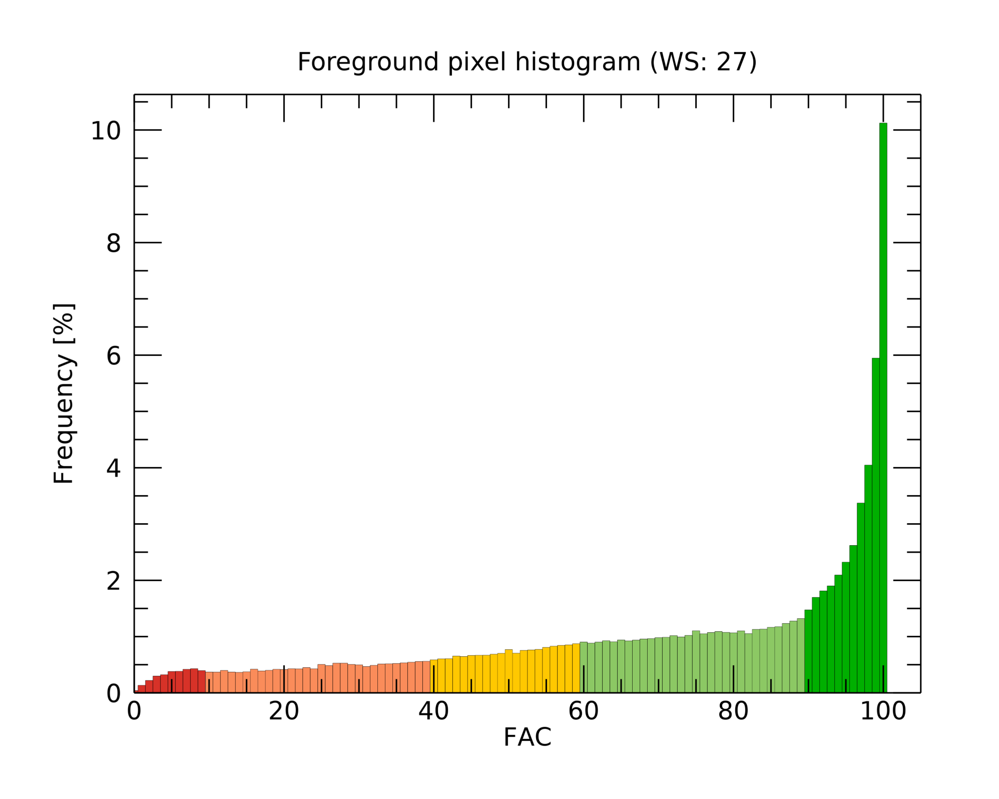

Fragmentation (GWB_FRAG)
========================

This module conducts the **Fragmentation** analysis at a single (or multiple) 
**user-specified** observation scale. The result consists of a spatially explicit map,
a histogram, and tabular summary statistics. Details on the methodology and input/output 
options can be found in the 
`Fragmentation <https://ies-ows.jrc.ec.europa.eu/gtb/GTB/psheets/GTB-Fragmentation-FADFOS.pdf>`_ 
product sheet.

Requirements
------------

A single band (Geo)TIFF image in data format byte and either:

**Binary:**

-   0 byte: missing (optional)
-   1 byte: background
-   2 byte: foreground (forest)
-	3 byte: specific background (optional)
-	4 byte: non-fragmenting background (optional)

**Grayscale:** (grayt = grayscale threshold in [1,100])

-	[0, grayt-1] byte: background
-	[grayt, 100] byte: foreground
-	103 byte: specific background (optional)
-	104 byte: non-fragmenting background (optional)
-	255 byte: missing (optional)

Processing parameter options are stored in the file :code:`input/frag-parameters.txt`.

.. code-block:: text

    ;;;;;;;;;;;;;;;;;;;;;;;;;;;;;;;;;;;;;;;;;;;;;;;;;;;;;;;;;;;;;;;;;;;;;;;;;;;;
    ;; GWB_FRAG parameter file:
    ;; NOTE: do NOT delete or add any lines in this parameter file!
    ;; Fragmentation analysis at up to 10 user-selected Fixed Observation Scales (FOS):
    ;; GWB_FRAG will provide one (1) image and summary statistics per observation scale
    ;;
    ;; Method_Reporting: choose one of the following 3 methods to analyze the Foreground (FG) pixels:
    ;;    FAD (FG Area Density); FED (FG Edge Density); FAC (FG Area Clustering):
    ;; combined with one of the follwing 2 reporting options, per-pixel or average per-patch (APP):
    ;;    FAD/FED/FAC_5/6: per-pixel reporting, color-coded into 5 or 6 fragmentation classes
    ;;    FAD-APP/FED-APP/FAC-APP_2/5: per-patch reporting, color-coded into 2 or 5 classes
    ;;
    ;; Input map type (byte) and requirements: binary OR grayscale
    ;; - Binary: 1-background, 2-foreground, optional:
    ;;       0-missing, 3-special background, 4-non-fragmenting background
    ;; - Grayscale: [0, grayt-1]-background, [grayt, 100]-foreground (grayt = grayscale threshold in [1,100]), optional:
    ;;       255-missing, 103-special background, 104-non-fragmenting background
    ;; 
    ;; Please specify entries at lines 37-43 ONLY using the following syntax:
    ;; line 37: Method/reporting: FAD_5 (default) or FAD_6, FAD-APP_2, FAD-APP_5 (same for FED or FAC)
    ;; line 38: Foreground connectivity: 8 (default) or 4
    ;; line 39: pixel resolution [meters]
    ;; line 40: up to 10 window sizes (unit: pixels, uneven within [3, 501] ) in increasing order and separated by a single space.
    ;; line 41: high-precision: 1-float precision  (default)  or 0-rounded byte
    ;; line 42: statistics: 0 (no statistics - default) or 1 (add summary statistics)
    ;; line 43: input map type: Binary (default) or Grayscale grayt (e.g., Grayscale 30)
    ;;
    ;; an example parameter file using the default settings on a binary input map:
    ;; FAD_5
    ;; 8
    ;; 100
    ;; 27
    ;; 1
    ;; 0
    ;; Binary
    ****************************************************************************
    FAC_5
    8
    100
    27
    1
    1
    Binary
    ****************************************************************************

Example
-------

The results are stored in the directory :code:`output`, one directory for each input 
image accompanied by a log-file providing details on computation time and processing 
success of each input image.

:code:`GWB_FRAG` command and listing of results in the directory output:

.. code-block:: console

    $ GWB_FRAG -i=$HOME/input -o=$HOME/output
    IDL 9.1.0 (linux x86_64 m64).
    (c) 2024, NV5 Geospatial Solutions, Inc.

    GWB_FRAG using:
    dir_input= $HOME/input
    dir_output= $HOME/output
    % Loaded DLM: TIFF.
    Done with: clc3class.tif
    Done with: example.tif
    Done with: gscinput.tif
    Frag finished sucessfully

    $ ls -R output/
    output/:
    clc3class_frag/  example_frag/  frag.log
    
    
    output/clc3class_frag:
    clc3class_fos-fac_5class_27.png  clc3class_fos-fac_5class_27.tif  
    clc3class_fos-fac_5class.txt
    clc3class_fos-fac_5class_27.sav  clc3class_fos-fac_5class.csv

    output/example_frag:
    example_fos-fac_5class_27.png  example_fos-fac_5class_27.tif  
    example_fos-fac_5class.txt
    example_fos-fac_5class_27.sav  example_fos-fac_5class.csv

Example statistics and spatial result of custom-scale per patch analysis of the input 
image :code:`example.tif`, here FAC_5 showing fragmentation color-coded into five 
categories.

.. code-block:: text

    Fragmentation analysis using Fixed Observation Scale (FOS)
    (Fragmentation is complementary to Connectivity: Fragmentation = 100% - Connectivity)
    Method options: FAD - FG Area Density; FED - FG Edge Density; FAC - FG Area Clustering;
    Summary analysis for image: 
    example.tif
    ================================================================================
    Precision: floating point
    FOS parameter settings:
    Input type: Binary
    Foreground connectivity: 8-conn FG
    FOS-type selected: FAC_5
    Method: FAC
    Reporting style: FAC at pixel level
    Number of reporting classes: 5
    Pixel resolution [m]: 100.000
    Window size [pixels]: 27
    Observation scale [(window size * pixel resolution)^2]: 
    Observation scale:   1
    Neighborhood area:   27x27     
         [hectare]:     729.00
           [acres]:    1801.40
    ================================================================================
    Proportion [%] of foreground area in foreground cover class:
                   Rare (FAC-pixel value within: [0 - 9]):      3.0306
               Patchy (FAC-pixel value within: [10 - 39]):     13.7917
         Transitional (FAC-pixel value within: [40 - 59]):     14.4645
             Dominant (FAC-pixel value within: [60 - 89]):     31.2992
            Interior (FAC-pixel value within: [90 - 100]):     37.4139
    ================================================================================
    ================================================================================
    A) Image summary:
    ================================================================================
    Reporting unit area [pixels]: 999730
    Foreground area [pixels]: 428490
    Foreground area [%]: 42.8606
    Number of foreground patches: 2850
    Average foreground patch size: 150.34737
    ================================================================================
    B) Reporting levels
    ================================================================================
    Foreground (FG) connectivity is available at 4 reporting levels, at:
    B1) Pixel-level: method FAD/FED/FAC: check the FG pixel value on the map, or aggregated at
    B2) Patch-level: method _APP (Average-Per-Patch): check the FG pixel value on the map
    B3) Foreground-level: reference area = all foreground pixels
    - Average connectivity at WS [%]:     70.8060
    - ECA (Equivalent Connected Area) [pixels]: 221292.76
    - COH (Coherence = ECA/ECA_max*100) [%]: 51.644789
    B4) Reporting unit-level: reference area = entire reporting unit
    - Average connectivity at WS [%]:     30.3479
    - COH_ru (ECA/Reporting unit area*100) [%]: 22.135252
    ================================================================================
    ================================================================================
    Histogram of FG-pixel values rounded to the nearest integer, FGcover[%] at window size:
       Value    WS27    
         0     0.0411
         1     0.1351
         2     0.2219
         3     0.2992
         4     0.3230
         5     0.3806
         6     0.3841
         7     0.4196
         8     0.4303
         9     0.3956
        10     0.3701
        11     0.3692
        12     0.3998
        13     0.3701
        14     0.3648
        15     0.3753
        16     0.4215
        17     0.3888
        18     0.4014
        19     0.4189
        20     0.4159
        21     0.4292
        22     0.4273
        23     0.4507
        24     0.4280
        25     0.5064
        27     0.5281
        28     0.5284
        29     0.5057
        30     0.4985
        31     0.4682
        32     0.4899
        33     0.5137
        34     0.5167
        35     0.5230
        36     0.5333
        38     0.5582
        39     0.5613
        40     0.5869
        41     0.6049
        43     0.6535
        44     0.6462
        45     0.6649
        46     0.6686
        47     0.6696
        48     0.6868
        49     0.7029
        50     0.7697
        51     0.7050
        52     0.7547
        53     0.7622
        54     0.7722
        55     0.8087
        56     0.8294
        57     0.8434
        58     0.8532
        59     0.8742
        61     0.8833
        62     0.9027
        63     0.9270
        64     0.9081
        65     0.9405
        66     0.9242
        67     0.9389
        68     0.9568
        69     0.9638
        70     0.9816
        71     0.9888
        72     1.0171
        73     0.9944
        74     1.0215
        75     1.1041
        76     1.0502
        77     1.0733
        78     1.0910
        79     1.0745
        80     1.0672
        81     1.1015
        82     1.0530
        83     1.1281
        84     1.1326
        85     1.1650
        86     1.1758
        87     1.2334
        88     1.2761
        89     1.3202
        90     1.4747
        91     1.6971
        92     1.8117
        93     1.9004
        94     2.0939
        95     2.3226
        96     2.6192
        97     3.3737
        98     4.0479
        99     5.9481
       100    10.1246

.. figure:: ../_image/example_fos-fac_5class_27.tif
    :width: 100%

Remarks
-------

-   The result provides additional statistics in txt and csv format.
-   The IDL-specific sav-file can be used in GTB to conduct fragmentation 
    change analysis.
-   The result provides a fragmentation image and a occurrence frequency histogram
    for each custom observation scale. In the example above, the user selected 
    1 observation scale with a local neighborhood of 27x27 pixels.
-   This module provides options to use either FAD/FED/FAC, process for multiple 
    observation scales, report at pixel- or patch-level, and to select the number of 
    fragmentation classes (6, 5, 2).

Fragmentation has been used to map and summarize the degree of forest fragmentation in the
`FAO SOFO2020 <http://www.fao.org/publications/sofo/en/>`_ report and the Forest Europe 
`State of Europe's Forest 2020 <https://foresteurope.org/wp-content/uploads/2016/08/SoEF_2020.pdf>`_ 
report with additional technical details in the respective JRC Technical Reports for 
`FAO <https://doi.org/10.2760/145325>`_ and `FE <https://doi.org/10.2760/991401>`_. 
The index FAD is adopted in EU policy to report on forest connectivity in the `8th
Environmental Action programme <https://eur-lex.europa.eu/legal-content/EN/TXT/HTML/?uri=CELEX:52022DC0357&from=EN>`_ 
and the `Nature Restoration Regulation <https://eur-lex.europa.eu/legal-content/EN/TXT/?uri=CELEX:32024R1991>`_. 