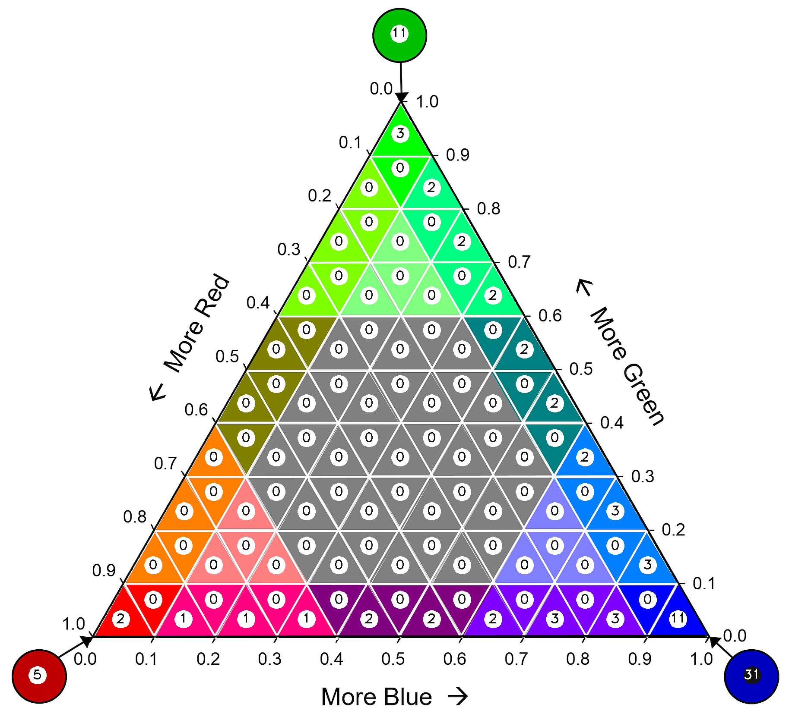

Landscape Mosaic (GWB_LM)
=========================

This module conducts the **Landscape Mosaic** analysis at up to 10 **user-selected 
observation scales**. The Landscape Mosaic measures land cover heterogeneity, or human 
influence, in a tri-polar classification of a location accounting for the relative 
contributions of the three land cover types **Agriculture**, **Natural**, **Developed** 
in the area surrounding that location. The result are spatially explicit maps and tabular 
summary statistics. Details on the methodology and input/output options can be found in the 
`Landscape Mosaic <https://ies-ows.jrc.ec.europa.eu/gtb/GTB/psheets/GTB-Pattern-LM.pdf>`_ 
product sheet.

Requirements
------------

A single band (Geo)TIFF image in data format byte:

-   0 byte: missing (optional)
-   1 byte: Agriculture
-   2 byte: Natural
-   3 byte: Developed

.. warning::

    Input image values > 3 byte will be considered as missing data

Processing parameter options are stored in the file :code:`input/lm-parameters.txt`.

.. code-block:: text

    ;;;;;;;;;;;;;;;;;;;;;;;;;;;;;;;;;;;;;;;;;;;;;;;;;;;;;;;;;;;;;;;;;;;;;;;;;;;;
    ;; GTB_LM parameter file:
    ;; NOTE: do NOT delete or add any lines in this parameter file!
    ;;
    ;; LM will provide up to 10 images and summary statistics.
    ;; Please specify entries at line 14 ONLY using the following options:
    ;; line 14: kdim: up to 10 window sizes (unit: pixels, uneven within [3, 501] ) in increasing order and separated by a single space.
    ;;          obs_scale [hectare] = (pixres[m] * kdim)^2 / 10000
    ;;
    ;; example parameter file
    ;; (assuming a pixel resolution of 30m, a 11x11 window ~ 10.9 ha):
    ;; 11
    ****************************************************************************
    23
    ****************************************************************************

Example
-------

The results are stored in the directory :code:`output`, one directory for each input 
image accompanied by a log-file providing details on computation time and processing 
success of each input image.

:code:`GWB_LM` command and listing of results in the directory output:

.. code-block:: console

    $ GWB_LM -i=$HOME/input -o=$HOME/output
    IDL 8.8.3 (linux x86_64 m64).
    (c) 2022, Harris Geospatial Solutions, Inc.

    GWB_LM using:
    dir_input= $HOME/input
    dir_output= $HOME/output
    % Loaded DLM: TIFF.
    % Loaded DLM: PNG.
    Done with: clc3class.tif
    Done with: example.tif
    LM finished sucessfully

    $ ls -R output/
    output/:
    clc3class_lm_23  example_lm_23  lm23.log

    output/clc3class_lm_23:
    clc3class_lm_23_103class.tif  clc3class_lm_23_heatmap.png   clc3class_lm_23.tif
    lm103class_legend.png         clc3class_lm_23_heatmap.csv   clc3class_lm_23_heatmap.sav
    heatmap_legend.png

    output/example_lm_23:
    example_lm_23_103class.tif  example_lm_23_heatmap.png   example_lm_23.tif
    lm103class_legend.png       example_lm_23_heatmap.csv   example_lm_23_heatmap.sav
    heatmap_legend.png

Example statistics (heatmap) and spatial result of the custom-scale analysis of the 
input image :code:`clc3class.tif`, showing the degree of predominance of land cover 
types Agriculture, Natural, Developed.

.. image:: ../_image/clc3class_lm_23.tif
    :width: 49%

Remarks
-------

-   The IDL-specific sav-file can be used in GTB to conduct LM change analysis.
-   LM is not restricted to **Ag**, **Nat**, **Dev** but can be applied to any 3 types 
    of dominant land cover.
-   The result provides the LM analysis for a single custom observation scale. In the 
    example above, and assuming a pixel resolution of 100 meter, an observation scale 
    of 23x23 pixels corresponds to a local neighborhood (analysis scale) of 
    2300x2300 meters ~ 50 hectare.
-   The heatmap facilitates assessments of temporal changes and/or comparison between 
    different sites.

The Landscape Mosaic has been used to map and summarize the degree of landscape 
heterogeneity in many occasions (see references in the 
`Landscape Mosaic <https://ies-ows.jrc.ec.europa.eu/gtb/GTB/psheets/GTB-Pattern-LM.pdf>`_ 
product sheet), including the `RPA <https://www.srs.fs.usda.gov/pubs/37766>`_, 
`Embrapa <https://urldefense.com/v3/__https:/www.infoteca.cnptia.embrapa.br/infoteca/bitstream/doc/1126895/1/Livro-Doc-345-1815-final-3.pdf__;!!DOxrgLBm!QdlMk1JDuaLmRLWA6JeqizIFwET3sAHqnWlLDX8vQnfpu9edG2iAIws94-RV3jkaakScfw$>`_, and `MAES <https://doi.org/10.2760/757183>`_ reports.
