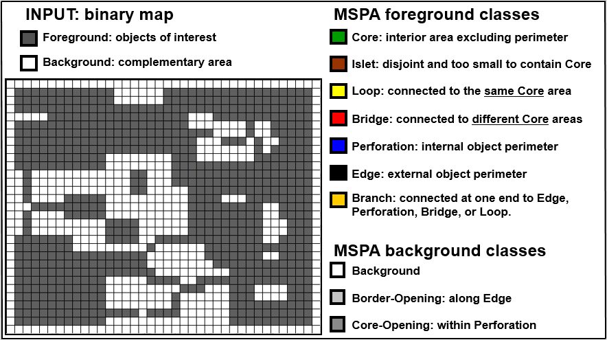
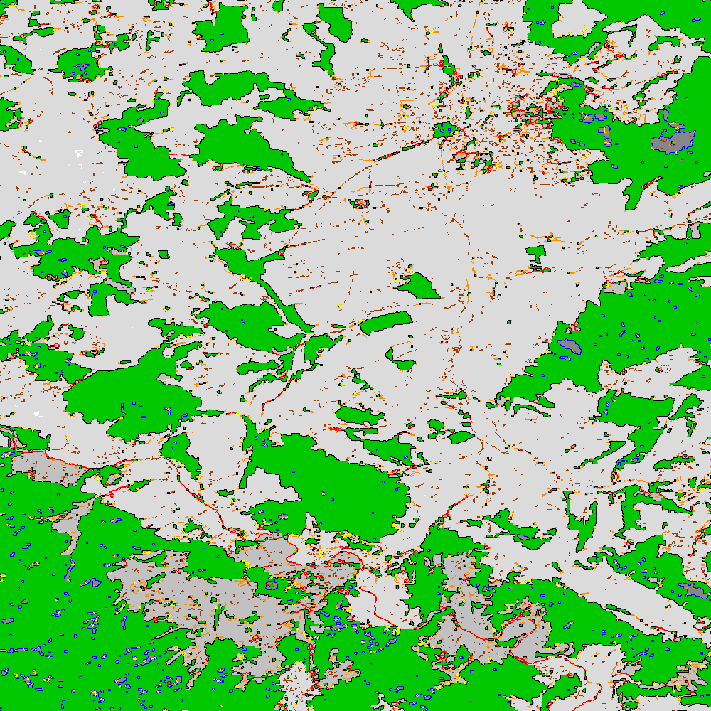

Morphology (GWB_MSPA)
=====================

.. warning::

    If you are considering using the MSPA module, keep in mind that the result provides 
    a lot of information (up to 23 classes). The alternative module :code:`GWB_SPA` 
    provides a similar but simplified assessment with up to 6 classes only. Both modules 
    describe morphological features of foreground objects. Also note that while MSPA may 
    address certain features of fragmentation, a more comprehensive assessment of 
    fragmentation is obtained with the dedicated fragmentation modules :code:`GWB_FRAG`.

This module conducts the **Morphological Spatial Pattern Analysis**. 
`MSPA <https://forest.jrc.ec.europa.eu/en/activities/lpa/mspa/>`_ analyses shape and 
connectivity and conducts a segmentation of foreground (i.e. forest) objects in up to 23 
morphological feature classes. The result are spatially explicit maps and tabular 
summary statistics. Details on the methodology and input/output options can be found in the 
`Morphology <https://ies-ows.jrc.ec.europa.eu/gtb/GTB/psheets/GTB-Pattern-Morphology.pdf>`_ 
product sheet.

Requirements
------------

A single band (Geo)TIFF image in data format byte:

-   0 byte: missing (optional)
-   1 byte: background
-   2 byte: foreground (forest)

Processing parameter options are stored in the file :code:`input/mspa-parameters.txt`.

.. code-block:: text

    ;;;;;;;;;;;;;;;;;;;;;;;;;;;;;;;;;;;;;;;;;;;;;;;;;;;;;;;;;;;;;;;;;;;;;;;;;;;;
    ;; GWB_MSPA parameter file:
    ;; NOTE: do NOT delete or add any lines in this parameter file!
    ;;
    ;; MSPA: Morphological Spatial Pattern Analysis (up to 23 classes)
    ;; Input image requirements: 1b-background, 2b-foreground, optional: 0b-missing
    ;;
    ;; MSPA will provide an image and summary statistics.
    ;; (see tools/docs/MSPA_Guide.pdf for details)
    ;; Please specify entries at lines 27-32 ONLY using the following options:
    ;;
    ;; line 27: MSPA parameter 1: Foreground connectivity: 8 (default) or 4
    ;; line 28: MSPA parameter 2: EdgeWidth: 1 (default) or larger integer values
    ;; line 29: MSPA parameter 3: Transition: 1 (default) or 0
    ;; line 30: MSPA parameter 4: IntExt: 1 (default) or 0
    ;; line 31: disk: 0 (default) or 1 (requires 20% less RAM but +40% processing time)
    ;; line 32: statistics: 0 (default) or 1 (add summary statistics)
    ;;
    ;; a parameter file with the default settings would look like this:
    ;; 8
    ;; 1
    ;; 1
    ;; 1
    ;; 0
    ;; 0
    ****************************************************************************
    8
    1
    1
    1
    0
    1
    ****************************************************************************

Example
-------

The results are stored in the directory :code:`output`, one directory for each input 
image accompanied by a log-file providing details on computation time and processing 
success of each input image.

:code:`GWB_MSPA` command and listing of results in the directory output:

.. code-block:: console

    $ GWB_MSPA -i=$HOME/input -o=$HOME/output
    IDL 9.1.0 (linux x86_64 m64).
    (c) 2024, NV5 Geospatial Solutions, Inc.

    GWB_MSPA using:
    dir_input= $HOME/input
    dir_output= $HOME/output
    % Loaded DLM: TIFF.
    Done with: clc3class.tif
    Done with: example.tif
    Done with: gscinput.tif
    MSPA processing finished sucessfully

    $ ls -R output/
    output/:
    example_mspa  mspa.log

    output/example_mspa:
    example_8_1_1_1.tif  example_8_1_1_1.txt

Example statistics of the input image :code:`example.tif` and explanatory sketch of the 
basic MSPA feature classes:

.. code-block:: text

    MSPA results using:
    example (MSPA: 8_1_1_1, FG_area: 428490, iFG_area: 485606)

    MSPA-class [color]:  FG/data pixels [%]  #/BGarea
    ============================================================
        CORE(s) [green]:            --/--     0
        CORE(m) [green]:      75.09/32.19     1196
        CORE(l) [green]:            --/--     0
          ISLET [brown]:       3.26/ 1.40     2429
     PERFORATION [blue]:       2.17/ 0.93     423
           EDGE [black]:      13.54/ 5.80     890
          LOOP [yellow]:       0.60/ 0.26     541
           BRIDGE [red]:       1.42/ 0.61     765
        BRANCH [orange]:       3.93/ 1.68     4685
      Background [grey]:         --/57.14     2319/571240
        Missing [white]:            0.03        51/270
         Opening [grey]:      1.50 Porosity   2291/57116
    Core-Opening [darkgrey]:       --/ 0.59    717/5927
      Border-Opening [grey]:       --/ 5.12   1574/51189

Remarks
-------

-   MSPA is very versatile and can be applied to any binary map, scale and thematic layer. 
    Please consult the 
    `MSPA Guide <https://ies-ows.jrc.ec.europa.eu/gtb/GTB/MSPA_Guide.pdf>`_, the 
    `Morphology product sheet <https://ies-ows.jrc.ec.europa.eu/gtb/GTB/psheets/GTB-Pattern-Morphology.pdf>`_ 
    and/or the `MSPA website <https://forest.jrc.ec.europa.eu/en/activities/lpa/mspa/>`_ 
    for further information.
-   The simplified version, :code:`GWB_SPA` provides fewer classes. It may be useful to 
    get started and may be sufficient to address many assessments.

MSPA is a purely geometric analysis scheme, which can be applied to any type of raster 
image. It has been used in numerous peer-reviewed publications to map and summarize the 
spatial pattern, fragmentation and connectivity of forest and other land cover patches, 
including the detection of structural and functional connecting pathways, analyzing urban 
greenspace, landscape restoration up to classifying zooplankton species.
