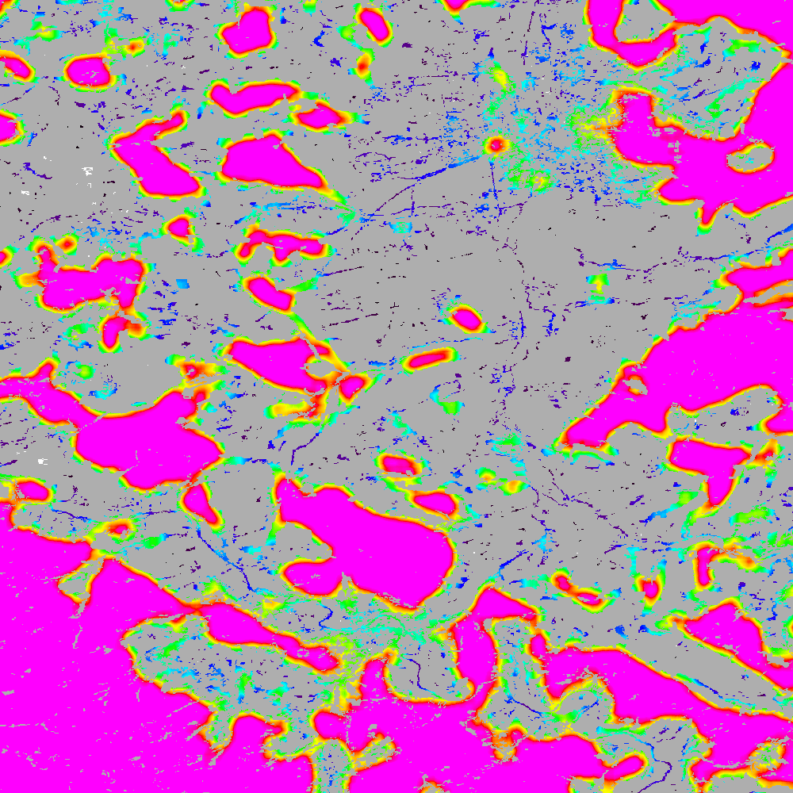

Density - Contagion - Adjacency (GWB_P223)
==========================================

This module will conduct the **Density** (P2), **Contagion** (P22) or **Adjacency** (P23) analysis of foreground (**FG**) objects at a user-selected observation scale (`Riitters et al. (2000) <https://www.srs.fs.usda.gov/pubs/ja/ja_riitters006.pdf>`_). The result are spatially explicit maps and tabular summary statistics. The classification is determined by measurements of forest amount (P2) and connectivity (P22) within the neighborhood that is centered on a subject forest pixel. P2 is the probability that a pixel in the neighborhood is forest, and P22 is the probability that a pixel next to a forest pixel is also forest.

Requirement
-----------

Single band geotiff in data format byte:

-   0 byte: missing (optional)
-   1 byte: background
-   2 byte: foreground (forest)
-   3 byte: specific background (for P23 only)

Processing parameter options are stored in the file :code:`input/p223-parameters.txt`.

.. code-block:: text

    ;;;;;;;;;;;;;;;;;;;;;;;;;;;;;;;;;;;;;;;;;;;;;;;;;;;;;;;;;;;;;;;;;;;;;;;;;;;;
    ;; GTB_P223 parameter file:
    ;;    ***  do NOT delete header lines starting with ";;" ***
    ;;
    ;; FG-Density (P2), FG-Contagion (P22), or FG-Adjacency (P23)
    ;; Input image requirements: 1b-background, 2b-foreground,
    ;; 3b-specific background (for P23), optional: 0b-missing
    ;;
    ;; P223 will provide a color-coded image showing [0,100]% for either
    ;; FG-Density, FG-Contagion, or FG-Adjacency masked for the Foreground cover.
    ;; Use the alternative options 11, 12, 13 to obtain the original spatcon
    ;; output without normalisation, masking, or color-coding.
    ;;
    ;; For original spatcon output ONLY:
    ;; Missing values are coded as 0 (rounded byte), or -0.01 (float precision).
    ;; For all output types, missing indicates the input window contained
    ;; only missing pixels.
    ;; For FG-Contagion and FG-Adjacency output only, missing also indicates
    ;; the input window contained no foreground pixels (there was no information
    ;; about foreground edge).
    ;; For all output types, rounded byte = (float precision * 254) + 1
    ;;
    ;; Please specify entries at lines 41-43 ONLY using the following options:
    ;; line 41:  1 FG-Density   (FG-masked and normalised), or
    ;;           2 FG-Contagion (FG-masked and normalised), or
    ;;           3 FG-Adjacency (FG-masked and normalised), or
    ;;          11 FG-Density   (original spatcon output), or
    ;;          12 FG-Contagion (original spatcon output), or
    ;;          13 FG-Adjacency (original spatcon output), or
    ;;          14 FG-Shannon   (original spatcon output), or
    ;;          15 FG-SumD      (original spatcon output)
    ;; line 42: kdim: square window size [pixels], uneven in [3, 5, ..., 501]
    ;;          obs_scale [hectare] = (pixres * kdim)^2 / 10000
    ;; line 43: high-precision: 1 (default, float precision) or 0 (rounded byte)
    ;;
    ;; an example parameter file for FG-Density and using a 27x27 window:
    ;; 1
    ;; 27
    ;; 1
    ****************************************************************************
    1
    27
    1
    ****************************************************************************

Example
-------

The results are stored in the directory :code:`output`, one directory for each input image accompanied by a log-file providing details on computation time and processing success of each input image.

:code:`GWB_P223` command and listing of results in the directory output:

.. code-block:: console

    $ GWB_P223 -i=~/input -o=~/output
    IDL 8.8.0 (linux x86_64 m64).
    (c) 2020, Harris Geospatial Solutions, Inc.

    GWB_P223 using:
    dir_input= ~/input
    dir_output= ~/output
    % Loaded DLM: TIFF.
    Done with: clc3class.tif
    Done with: example.tif
    P2 finished sucessfully

    $ ls -R output/
    output/:
    example_p2_27  p2_27.log

    output/example_p2_27:
    example_p2_27.tif  example_p2_27.txt

Example statistics and spatial result of the input image :code:`example.tif` for P2, showing degree of forest density:

.. code-block:: text

    P2-summary at Observation Scale: 27
    Total Foreground Area [pixels]: 428490
    Average P2: 73.7660

Remarks
-------

-   Density, Contagion or Adjacency are scale-dependent (specified by the size of the moving window).
-   This moving window approach (originally called Pf/Pff) forms the base for other derived analysis schemes, such as :code:`GWB_LM`/:code:`GWB_FAD`/:code:`GWB_FRAG`.

Both, Density and Contagion add a first spatial information content on top of the primary information of forest, forest amount. Information on forest Density and Contagion is an integral part of many national forest inventories and forest resource assessments. However, the derived products Fragmentation and Landscape Mosaic may be easier to communicate.