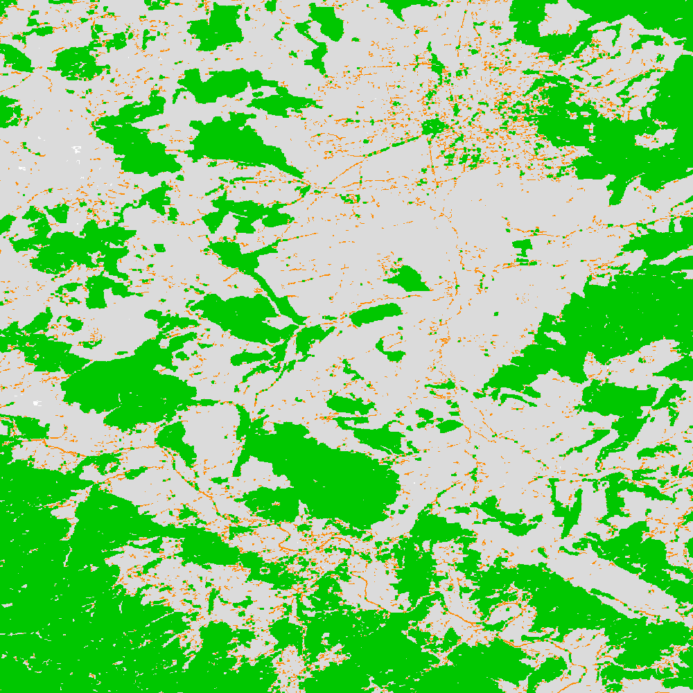

Simplified Pattern Analysis (GWB_SPA)
=====================================

This module will conduct the **Simplified Pattern Analysis**. SPA analyses shape and conducts a segmentation of foreground patches into 2, 3, 5, or 6 feature classes. The result are spatially explicit maps and tabular summary statistics. :code:`GWB_SPA` is a simpler version of :code:`GWB_MSPA`. Details on the methodology and input/output options can be found in the `Morphology <https://ies-ows.jrc.ec.europa.eu/gtb/GTB/psheets/GTB-Pattern-Morphology.pdf>`_ product sheet.

Requirements
------------

Single band geotiff in data format byte:

-   0 byte: missing (optional)
-   1 byte: background
-   2 byte: foreground (forest)

Processing parameter options are stored in the file :code:`input/spa-parameters.txt`.

.. code-block:: text

    ;;;;;;;;;;;;;;;;;;;;;;;;;;;;;;;;;;;;;;;;;;;;;;;;;;;;;;;;;;;;;;;;;;;;;;;;;;;;
    ;; GTB_SPA parameter file:
    ;;    ***  do NOT delete header lines starting with ";;" ***
    ;;
    ;; SPA: Spatial Pattern Analysis (2, 3, 5, or 6 classes)
    ;; Input image requirements: 1b-background, 2b-foreground, optional: 0b-missing
    ;;
    ;; SPAx will provide an image and summary statistics using 8-connectivity.
    ;; Line 18: enter a single number, representing the number of pattern classes:
    ;; 2: SLF, Contiguous
    ;; 3: Core, Core-Openings, Margin
    ;; 5: Core, Core-Openings, Edge, Perforation, Margin
    ;; 6: Core, Core-Openings, Edge, Perforation, Islet, Margin
    ;;
    ;; an example parameter file would look like this:
    ;; 5
    ****************************************************************************
    2
    ****************************************************************************

Example
-------

The results are stored in the directory :code:`output`, one directory for each input image accompanied by a log-file providing details on computation time and processing success of each input image.

:code:`GWB_SPA` command and listing of results in the directory output:

.. code-block:: console

    $ GWB_SPA -i=~/input -o=~/output
    IDL 8.8.0 (linux x86_64 m64).
    (c) 2020, Harris Geospatial Solutions, Inc.

    GWB_SPA using:
    dir_input= ~/input
    dir_output= ~/output
    % Loaded DLM: TIFF.
    Done with: clc3class.tif
    Done with: example.tif
    SPA2 finished sucessfully

    $ ls -R output/
    output/:
    example_spa2  spa2.log

    output/example_spa2:
    example_spa2.tif  example_spa2.txt

Statistics and spatial result of the input image :code:`example.tif` showing a 2-class segmentation (SPA2): Contiguous and Small & Linear Features (SLF):

.. code-block:: text

    SPA2: 8-connected Foreground, summary analysis for image:
    ~/input/example.tif

    Image Dimension X/Y: 1000/1000
    Image Area =               Data Area                    + No Data (Missing) Area
            = [ Foreground (FG) +   Background (BG)  ]     +          Missing
            = [        FG       + {Core-Opening + other BG} ] +       Missing

    ================================================================================
            Category              Area [pixels]:
    ================================================================================
            Contiguous:                 388899
    +              SLF:                  39591
    --------------------------------------------------------------------------------
    = Foreground Total:                 428490
    + Background Total:                 571240
    --------------------------------------------------------------------------------
    =  Data Area Total:                 999730

             Data Area:                 999730
    +          Missing:                    270
    --------------------------------------------------------------------------------
    = Image Area Total:                1000000

    ================================================================================
            Category    Proportion [%]:
    ================================================================================
       Contiguous/Data:     38.9004
    +         SLF/Data:      3.9602
    --------------------------------------------------------------------------------
               FG/Data:     42.8606
    --------------------------------------------------------------------------------
         Contiguous/FG:     90.7603
    +           SLF/FG:      9.2397
    ================================================================================

    ================================================================================
            Category          Count [#]:
    ================================================================================
            Contiguous:             847
            FG Objects:            2850
                   SLF:            6792
    ================================================================================

Remarks
-------

-   The full version, GWB_MSPA provides many more features and classes.
-   Please use :code:`GWB_MSPA` if you need an edge width > 1 pixel and/or to detect connecting pathways.

:code:`GWB_SPA` is a purely geometric analysis scheme, which can be applied to any type of raster image. It is ideal to describe the morphology of foreground (forest) patches for basic mapping and statistics, which may be sufficient in many application fields. Advanced analysis, including the detection of connecting pathways require using the full version :code:`GWB_MSPA`.